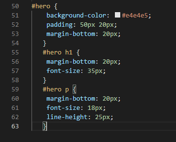
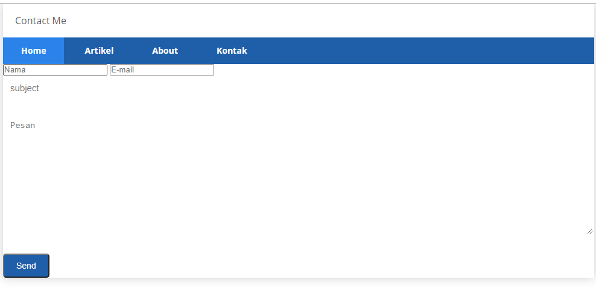

# Lab4Web
# Pertama tama, Kita buat lab4_box.html pada VSC, dan ikuti code berikut
- Source Code :
- 
- Hasilnya akan menjadi seperti ini
- 
- Kemudian tambahkan div baru yaitu div4 dengan property clear
- 
- 
- ini hasilnya 
- 
- kita bisa setting left atau right disini untuk percobaan
- 
- Hasilnya seperti berikut
- 

# Membuat Layout Sederhana
- Basicnya kita membuat menu dan juga isi sederhana dulu menggunakan css seperti ini
- 
- 
- Buat CSS untuk layoutnya, ini contohnya
- 
- 
- Kita buat Navigasi, contohnya bisa di ikuti :
- 
- 
- kita akan membuat isi dari hero panel seperti berikut
- 
- sertakan langsung CSS nya
- 
- Hasilnya 
- 
- Mengatur layout main dan sidebar
- kita gunakan float dan isi widgetnya untuk sidebar
- 
- 
- Kita sertakan juga CSS untuk sidebar nya
- 
- berikut hasilnya
- 
- Kita akan membuat footer, sangat mudah, source dibawah
- 
- 
- menambahkan elemen pada main content,
- 
- 
- tambahkan elemen CSS
- 
- hasilnya seperti berikut
- 
- Kita akan menambahkan article content
- 
- 
- hasilnya seperti berikut
- 

# Pertanyaan
1 Tambahkan Layout untuk menu About
- buat single layout yang berisi deskripsi, portofolio, dll.
- membuat about.html sebagai berikut dan tambahkan CSS nya
- 
- 
- hasilnya seperti berikut
- 

2 Tambahkan Layout untuk menu Contact
- yang berisi form isian: Nama, Email, Message, dll.
- kita buat contact.html , serta tambahkan CSS nya
- 
- 
- hasilnya seperti berikut
- 
